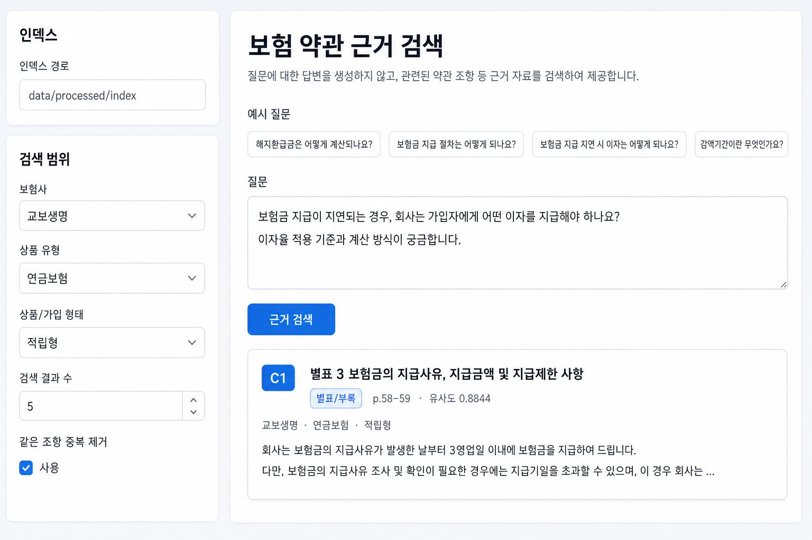

# Insurance Policy Intelligence

**Retrieval-first** tooling for **public Korean insurance policy PDFs**: build a local index over section-aware chunks, run **metadata-scoped dense search**, and return **`CitationContextBundle`** — citation-ready evidence (passages + handles like `C1`, `C2`), **not** model-written answers. A small **FastAPI** service and **Vite + React** web UI expose the same JSON over HTTP.

This is **evidence search infrastructure**, not an LLM product: **no** in-repo chatbot, **no** answer synthesis, **no** generation pipeline in the current MVP.



---

## Architecture

```text
PDFs → ingest → sections → chunks → index → citation context → API → web UI
```

| Area | Location |
|------|----------|
| Evidence UI | `apps/web/` |
| HTTP API | `packages/api/` |
| Retrieval + eval | `packages/retrieval/` |
| Ingestion | `packages/ingestion/` |
| Staged PDFs + manifest | `data/inbox/manual/`, `data/raw/manual/`, `data/manifests/` |
| Generated artifacts | `data/processed/*` (mostly gitignored) |
| Retrieval benchmark | `data/eval/retrieval_queries.yaml` |
| Docs | `docs/` |
| Docker API | `infra/docker-compose.yml`, `infra/docker/Dockerfile.api` |

**Stack:** Python 3.12+, **uv**, **FastAPI**, **sentence-transformers** + **NumPy** (local index), **Vite** + **React** + **TypeScript** (`apps/web`), **Ruff**, **mypy**, **pytest**.

---

## Quickstart

The **API** and **web UI** return the same **`CitationContextBundle`**: ranked **source passages** with `citation_id` handles — **not** model-written answers. The UI is for **browsing evidence** and optional inspection JSON only.

`data/processed/*` is **generated locally** (usually **gitignored**). The web UI **does not** build an index. You need **`data/processed/index`** (from `build_index`) before **`/retrieval/options`** and **`/retrieval/context`** work. The first **`build_index`** may download the embedding model from Hugging Face (see [`docs/retrieval_baseline.md`](docs/retrieval_baseline.md)).

### A. Index already exists (`data/processed/index` on disk)

**Terminal 1** (repo root):

```bash
uv run uvicorn insurance_ai_api.main:app --host 127.0.0.1 --port 8765
```

**Terminal 2:**

```bash
cd apps/web
npm.cmd ci
npm.cmd run dev
```

Use `npm ci` / `npm run dev` on macOS/Linux if `npm` resolves normally. Open **http://localhost:5173** (or the URL Vite prints).

**Try:** 보험사 **교보생명**, 상품 유형 **연금보험**, 상품/가입 형태 **적립형**, 질문 **보험금 지급이 늦어지면 이자는 어떻게 계산돼?** — expect citation cards (**C1**, …) and appendix-style hits (e.g. **별표 3**) when that corpus is in your index.

### B. Fresh clone or no index — minimal pipeline, then A

From the **repository root**. New PDFs in `data/inbox/manual/` must be **staged** into `data/raw/manual/` first — see [`docs/data-staging.md`](docs/data-staging.md) (`stage_manual_inbox.py` preview, then `--apply`).

```bash
uv sync
uv run python -m insurance_ai_ingestion.ingest_manifest --manifest data/manifests/manual.yaml --output-dir data/processed/documents
uv run python -m insurance_ai_ingestion.inspect_documents --input-dir data/processed/documents --report-path data/processed/reports/ingestion_quality.md
uv run python -m insurance_ai_ingestion.detect_sections --input-dir data/processed/documents --output-dir data/processed/sections
uv run python -m insurance_ai_ingestion.chunk_sections --input-dir data/processed/sections --output-dir data/processed/chunks
uv run python -m insurance_ai_ingestion.inspect_chunks --input-dir data/processed/chunks --report-path data/processed/reports/chunk_quality.md
uv run python -m insurance_ai_retrieval.build_index --chunks-dir data/processed/chunks --index-dir data/processed/index
```

Then run **[A](#a-index-already-exists-dataprocessedindex-on-disk)**. Optional **CLI search**, **citation context**, **`evaluate_retrieval`**, flags, and **`POST /retrieval/context` JSON** details: [`docs/retrieval_baseline.md`](docs/retrieval_baseline.md) (including [example request body](docs/retrieval_baseline.md#example-post-retrievalcontext-web-ui)).

### Troubleshooting

- **Search / dropdowns broken or empty:** ensure **`data/processed/index`** exists and the UI **인덱스 경로** matches how the API resolves paths (default `data/processed/index` when `uvicorn` runs from repo root).
- **Windows PowerShell:** use **`npm.cmd run dev`**, **`npm.cmd run build`**, **`npm.cmd ci`** if `npm` shims fail.
- **Port 8765 in use (Windows):** `netstat -ano | findstr :8765` then `taskkill /PID <pid> /F`.

---

## HTTP API

Returns **`CitationContextBundle`** (ranked evidence + metadata + scores), **not** synthesized answers. **CORS** allows the Vite dev origin (`localhost` / `127.0.0.1` on port **5173**). Start the server with the same **`uvicorn`** command as [Quickstart A](#a-index-already-exists-dataprocessedindex-on-disk).

| Method | Path | Role |
|--------|------|------|
| `GET` | `/health` | Liveness |
| `GET` | `/retrieval/options` | Filter dimensions for `index_dir` |
| `POST` | `/retrieval/context` | Citation-ready bundle for a query |

Request body example: [`docs/retrieval_baseline.md` — Example: POST /retrieval/context (web UI)](docs/retrieval_baseline.md#example-post-retrievalcontext-web-ui).

---

## Web UI (`apps/web`)

Korean-first **근거 검색**: dropdowns show **labels**; requests send **canonical slugs**. Collapsible raw JSON only; **no** chat history or model calls. Default API base **`http://127.0.0.1:8765`**; override at build time with **`VITE_API_BASE_URL`** (`apps/web/.env.example`) or in-app **API 연결 설정**. Install and dev server: **Terminal 2** in [Quickstart A](#a-index-already-exists-dataprocessedindex-on-disk). Production: `cd apps/web` then `npm.cmd run build`.

---

## Documentation

- [`docs/retrieval_baseline.md`](docs/retrieval_baseline.md) — index, search, filters, citation context CLI, eval, **HTTP POST body example**
- [`docs/testing_strategy.md`](docs/testing_strategy.md) — pytest vs YAML vs reports
- [`docs/overfitting_audit.md`](docs/overfitting_audit.md) — corpus coupling notes
- [`docs/data-staging.md`](docs/data-staging.md) — inbox / raw / manifest
- [`docs/section_detection.md`](docs/section_detection.md) — section pipeline

---

## Testing

```bash
uv run pytest
```

More context: [`docs/testing_strategy.md`](docs/testing_strategy.md).

---

## Data artifacts

| Path | Tracked? | Role |
|------|----------|------|
| `data/inbox/manual/`, `data/raw/manual/`, `data/manifests/manual.yaml` | Yes (where applicable) | Inputs + lineage |
| `data/processed/documents/`, `sections/`, `chunks/`, `index/` | No | Pipeline outputs |
| `data/processed/reports/` | No | Inspection / debug |
| `data/eval/retrieval_queries.yaml` | Yes | Retrieval benchmark |
| `examples/processed_documents/` | Yes | Small schema samples |

Ingestion reads **`data/raw/manual/`** paths from the manifest — see [`docs/data-staging.md`](docs/data-staging.md).

---

## Docker

```bash
docker compose -f infra/docker-compose.yml up --build
```

API listens on **8000** inside the container; map host ports as needed.

---

## Design philosophy

Favor **reproducible retrieval**, citations, and observability over chat-first demos without solid chunking.

---

## Disclaimer

This project uses only **public** insurance documents and local tooling for applied systems exploration.
